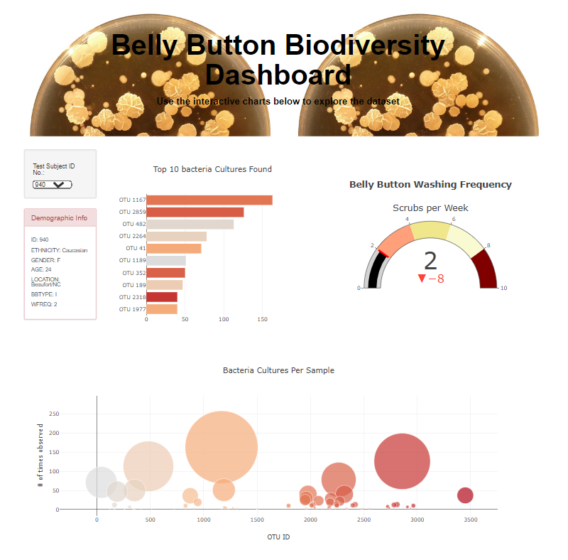

# Belly Button Bacterial Species Dashboard

## Interactive Dashboard using Plotly, JavaScript and D3.js

The output of this challenge is to deliver an interactive dashboard with graphs and tabular fields.

For further information here is a link to the dashboard to see the full functionability [github page](https://enricoroblesdelrio.github.io/BB_bacterial_species/)

And also an image is included here:

Dashboard:

